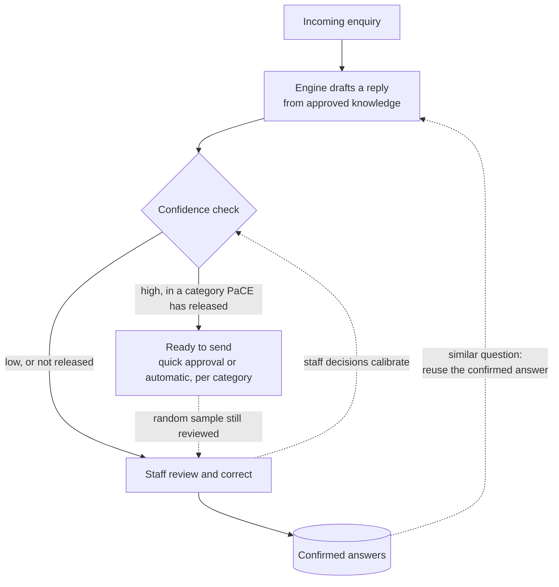

# Synvo Response to RSTN's Questions

**For:** RSTN, ahead of the technical call on Thursday 8 October 2026, 10:00 SGT

**From:** Synvo (Guowei Wang, AI tech lead; Li-kai Jiang)

**Attached:** *Pre-read for the technical call* (our question list)

**Updated:** after the 8 October call, with section 2 on self-learning

Thank you for the questions. Our answers are below, in your numbering. They set out our approach. Where an answer depends on something only RSTN or NTU can tell us, we have added a short question back. These are collected in section 3.

---

## In short

- **The engine sits behind your system as a service.** It replaces none of your components. RSTN calls it once per email and gets back a structured result.
- **It recommends; it never acts.** Sending, forwarding and case updates stay with RSTN and PaCE staff.
- **Proposed setup:** Synvo hosts the engine in Singapore. A small **privacy connector**, supplied by Synvo, runs in RSTN's network. It masks personal details before anything leaves NTU and puts them back in the result. Nothing is kept after the response.
- **It follows a fixed, auditable workflow,** not an open-ended agent. Every run returns a trace linked to your request ID.
- **Staff review goes down over time.** Every reply is reviewed at first. As staff approve and correct drafts, the engine learns which ones are safe, and review can be reduced category by category. This self-learning is planned for phase 2 (section 2).

---

## 1. Answers

### 1. What does the engine replace?

Nothing. The engine is a **service behind your system**. Your API, worker queue and database stay as they are. For each email, your system calls the engine and receives the issues found, a recommended action for each, a source-cited reply draft and a decision trace.

**a. Which components stay as they are?** All of them: Outlook intake, review console, audit log, login and roles. On your side, the additions are the call to the engine and, in the proposed setup, the privacy connector.

**b. Who handles email ingestion?** RSTN. Our POC did not connect to a live mailbox, and ingestion is not part of what we deliver.

### 2. Where does the engine run, which models, which region, and who decides?

- **Where it runs:** Synvo hosts the engine in Singapore. The privacy connector runs in RSTN's network, so only masked text leaves NTU. Nothing is kept after the response. Alternatives, if NTU policy requires them, are in answer 6.
- **Models:** the AI components are configurable and replaceable without changing the business rules. The services and regions used for NTU will be chosen to meet NTU's data policy, and listed in writing in our security pack and the data processing agreement. If NTU has a preferred platform, we can assess it. Any change is re-validated on NTU's sample emails before use.
- **Who decides:** NTU sets the constraints (residency, data classification, approved processors). Synvo proposes a setup that meets them and is accountable for its quality. RSTN integrates it.

### 3. A trace ID with our request ID, and per-step detail for the audit log?

Yes. Every result carries your request ID, our run ID and the versions of the engine, configuration and knowledge used. The trace records each processing step, its outcome and timing, and the sources used. It contains **no email text**, so it can go straight into your audit record. We would like to agree the exact fields with you (R8).

### 4. Agent design

**a. Loop or fixed graph?** A **fixed workflow**, not an open-ended loop. What each step may do is defined in advance, so runs are predictable and auditable.

**b. Limits, and what happens when a step fails?** Each run is bounded in steps, AI calls and time. If something fails, the result says so explicitly, and the engine never returns a reply that has not passed its independent check. RSTN then sends its approved acknowledgement and queues the case for staff. Exact limits will be agreed in the integration contract.

**c. Model calls and tokens per email?** Most of the workflow is rules; AI is used only where it adds value. We will measure usage on NTU's sample emails and report it by email type.

### 5. Integration contract and sandbox

Yes. We have a draft of the request and result fields. Once we have your XML schema or sample payloads, we will send the formal specification, covering call patterns (synchronous or asynchronous with a callback), error handling and versioning.

We will provide a **sandbox** with the engine and the connector, so you can start integration early.

### 6. How is the engine delivered? What if NTU requires on-premise?

- **Proposed:** a **running service** (hosted API), plus the privacy connector as a signed container in RSTN's network. The connector is small, runs on CPU and only connects out to the engine. We do not deliver source code or a library.
- **If the connector cannot be hosted:** RSTN calls the hosted engine directly. Data is masked on arrival and nothing is kept.
- **If NTU requires on-premise:** an on-premise licence, deployed in NTU's environment or in RSTN's AWS account with updates supplied by Synvo. It is quoted separately, and we would scope it with NTU's requirements.

### 7. How does the engine signal "I'm not sure"? Is there a confidence score?

We deliberately do **not** rely on a single confidence score, since such scores are usually not well calibrated. Instead, uncertainty is explicit and comes with a reason. For example, the engine says when it cannot tell which programme is meant, when the approved sources do not answer a question, or when its own check finds a statement without a source. In those cases it recommends **Ask for clarification** or **Manual handling** rather than guessing.

We will check how reliable these signals are on NTU's labelled sample emails, and again in the shadow run.

### 8. If we manage the knowledge base, what data store do we need? How is your DB designed?

You do **not** need to run a search system or a special database. What needs maintaining is the **content and its status**:
- **Approved knowledge:** programme pages, FAQs and policies, with versions and whether each item is active or withdrawn.
- **Programme registry:** programmes, aliases and owning teams.
- **Routing rules:** which team owns which kind of question.

We keep a versioned copy on our side and handle search ourselves. Withdrawn content is removed at once, and every answer cites the version it used.

**a. Attachments** are **not stored** by the engine. In the proposed setup they are read by the connector inside NTU, so they can be fetched from your side (e.g. Graph) when needed and never leave your network.

### 9. How does the engine learn from reviewer feedback?

Learning from staff feedback is **phase 2**; section 2 explains how it works. In phase 1 the engine changes only through tested, versioned releases. Our phase 2 principles:

- **a. Signals:** approvals, edits, reroutes and explicit feedback.
- **b. What gets updated:** reviewable items such as confirmed answers, routing rules and programme aliases, and the confidence check described in section 2. The underlying language models are not retrained on NTU data.
- **c. How quickly:** a confirmed answer can be reused once staff have confirmed it. Changes to the confidence check, and any release of a category, are tested before use, so not instantly.
- **d. Inspect and roll back:** yes, each learned item can be inspected and rolled back on its own.
- **e. Stopping one wrong correction from spreading:** human confirmation, testing before release, and a narrow scope for each change.

### 10. Does a 2–3 month POC timeline work for you?

In principle yes, provided four inputs arrive early: the XML schema or sample payloads, sample emails and screenshots, access to approved knowledge, and a decision on hosting the privacy connector. We will propose a plan after the call (R11).

### 11. What were your accuracy figures measured on, and which metrics?

To be clear: our evaluation so far used the POC's **constructed test scenarios** with a small fictional knowledge base, **not real client email**. It shows that the approach works (splitting questions, routing, citing sources, blocking unsupported statements), but it does **not** give an accuracy figure for live PaCE email.

We propose to measure accuracy on NTU's labelled sample emails before go-live, then again in a shadow run. Suggested measures: routing accuracy and misroute rate, accuracy of the recommended action, escalation rate, unsupported statements in replies, staff edit rate, and processing time. Targets are best agreed together (R10).

### 12. Emails with several questions

The engine splits the email into **separate issues**, and each gets its own programme, owning team and recommended action.

- **Reply:** **one combined reply** covering the issues that can be answered directly, with each statement linked to its source.
- **Issues owned by other teams:** each gets a **handoff note** for the receiving team, with the reason.
- **Independence:** an issue the engine cannot answer never blocks one it can.

For example, an email asking about intake, a training allowance and a payment has three issues: the first two can be answered, and the payment question goes to Manual handling.

### 13. When only some questions can be answered

The result lists **every issue with its own action and reason**, for example *Reply directly / Reply directly / Manual handling*. The reply draft states which issues it covers, and the others are listed with their action and reason. Your review console can show this per issue, so reviewers see at once which parts need a person. Whether the reply mentions that the remaining points will be followed up is a wording choice for PaCE.

### 14. Retention, deletion and separation

| Data | Kept? |
|---|---|
| Email content and attachments | **No.** Discarded once the result is returned. In the proposed setup the engine only sees masked text, and personal details never leave NTU. |
| "Memory" of a person or thread | **None.** The engine is stateless. Any context it needs comes in the request. |
| Traces | For an agreed period, with **no email text**. |
| Search index | **Only approved knowledge**, mostly public NTU content. Emails are never indexed. |

**a. Deletion requests:** we keep no personal data derived from emails, so there is nothing email-derived on our side to delete. Traces use an opaque reference rather than the sender's address and can be deleted by reference if needed.

**b. Separation from other clients:** NTU runs in a **dedicated environment** with its own keys, knowledge and configuration. Nothing is shared with other clients.

### 15. Export in a standard format

Yes. Traces can be exported in a standard format (e.g. JSON or CSV) keyed by your request ID. The knowledge copy can be exported as a dated snapshot. There is no memory to export. We can agree formats as part of the integration contract.

### 16. A live session and hands-on access

Yes. We are happy to run another online session with the engine processing sample emails live. Please propose a time and who will join. There is no client admin UI; hands-on access will come through the **integration sandbox**.

---

## 2. Self-learning: how the need for review goes down

**The goal:** at go-live, PaCE staff review every draft. Over time, the share of emails that need a person should fall steadily, without lowering the quality of what is sent.

**How it works.** Two mechanisms learn from what staff already do in the review console. Nobody has to label anything separately.

1. **Confirmed answers.** When staff approve or correct a reply, the confirmed answer is kept as a reviewed example, without personal details. When a similar question arrives, the engine starts from that confirmed answer. It still checks the answer against the current approved knowledge, so outdated content is not reused.
2. **Confidence check.** A separate check estimates, for each draft, how likely staff are to approve it unchanged. It is calibrated against PaCE's own past decisions (approved, edited or rerouted), not against the model's view of itself. This is not the kind of single, self-reported score we cautioned against in answer 7: it is measured against real outcomes and tested before anyone relies on it. As decisions accumulate, the check becomes more reliable, and more drafts qualify as ready to send.

**How review is reduced, step by step:**

| Stage | What staff do | Moves to the next stage when |
|---|---|---|
| 1. Learn | Review every draft, as at go-live. The engine records decisions and measures itself. | The confidence check proves reliable on PaCE's own decisions |
| 2. Fast track | Drafts marked "ready to send" need a quick approval; the rest get full review. | A category meets the agreed accuracy target over an agreed period |
| 3. Release by category | For categories PaCE releases (e.g. intake dates, fees, general programme questions), ready-to-send replies can go out without review. A random sample is still checked. | Ongoing, with monthly reporting |

**Safeguards:**
- **PaCE decides.** Releasing a category, and the threshold for it, is PaCE's decision, based on measured results. Sending stays with RSTN's system; the engine only marks a draft as ready.
- **Some categories are never released.** For example: payment and application status, complaints, personal circumstances, and anything the engine marks Ask for clarification or Manual handling.
- **Everything is reversible.** Each confirmed answer can be inspected and removed, and any category can be returned to full review at once.
- **Visible progress.** A regular report shows the share of emails needing review, approval and edit rates, and the results of spot checks, by category.

**When:** self-learning is not part of the current proof of concept. Staff decisions from the pilot provide the data for stage 1, so the design is in place from the start.

---

## 3. Our questions back

Items marked **★** are the ones we would most like to settle on the call. The full list, with our proposal for each, is in the attached pre-read; the IDs in brackets refer to it.

| # | Question | Follows from |
|---|---|---|
| R1 ★ | Can you share the **XML schema or 3–5 sample payloads** (email and web form), and how threads and follow-ups are identified? (A1, A2) | Q5 |
| R2 ★ | Should calls be **synchronous or asynchronous with a callback**? (A4) | Q4, Q5 |
| R3 ★ | Does NTU accept the **proposed setup**, where only masked text leaves NTU and nothing is kept? Who at NTU decides, and what do they need from us? (E1, E5) | Q2, Q14 |
| R4 ★ | Can RSTN **host the privacy connector** (one small container, CPU only)? Where would it run, and who deploys updates? (E2) | Q6 |
| R5 | Does NTU or RSTN have a **preferred platform or region**, or a list of approved processors, that we should design for? | Q2, Q6 |
| R6 ★ | Where does the **approved knowledge** live today, and may a versioned copy be synced to the engine? Does a **programme registry** with owning teams exist? (B1–B3) | Q8 |
| R7 | Are attachments in your system kept as **Graph references or stored copies**? (A3) | Q8 |
| R8 | Which **trace fields** does your audit record need, and how long must audit records be kept? (E4) | Q3, Q15 |
| R9 ★ | How many **sample emails** and **screenshots** can be shared, and when? Can each sample include how PaCE handled it? (C1, C2, C4) | Q10, Q11 |
| R10 ★ | Which **accuracy measures and targets** should phase 1 meet? (F1) | Q11 |
| R11 ★ | For the **2–3 month POC**: does it end with live use by PaCE staff, or with a shadow run and a go/no-go decision? Are there fixed dates, such as admission peaks? (F2, F3) | Q10 |
| R12 | How should the review console show **partly answered emails**? (A5) | Q13 |
| R13 | Is **learning from feedback** needed in the POC, or can it follow in phase 2? (U11) | Q9 |
| R14 | Who should join the **live session**, and which dates suit you? | Q16 |

We look forward to the call.

Synvo
